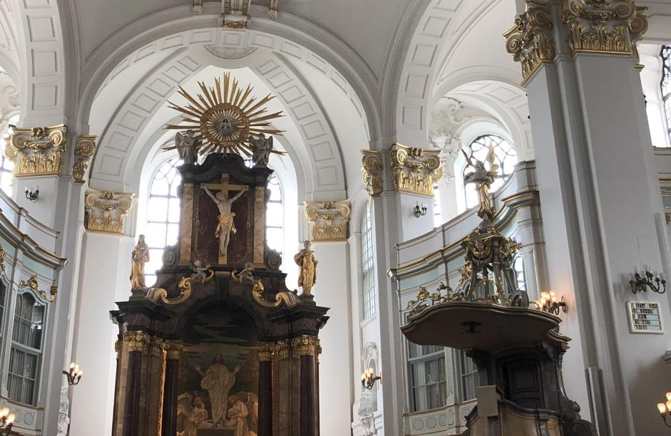
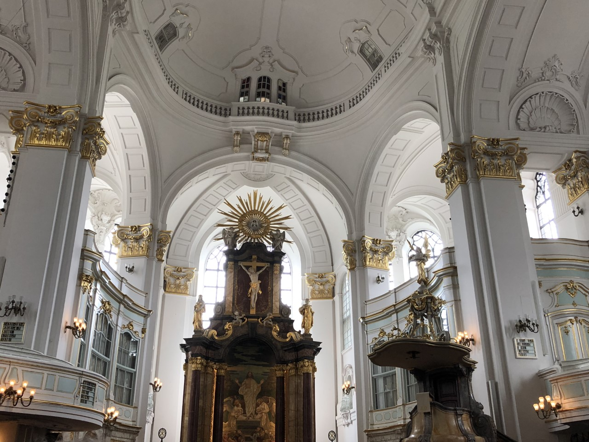
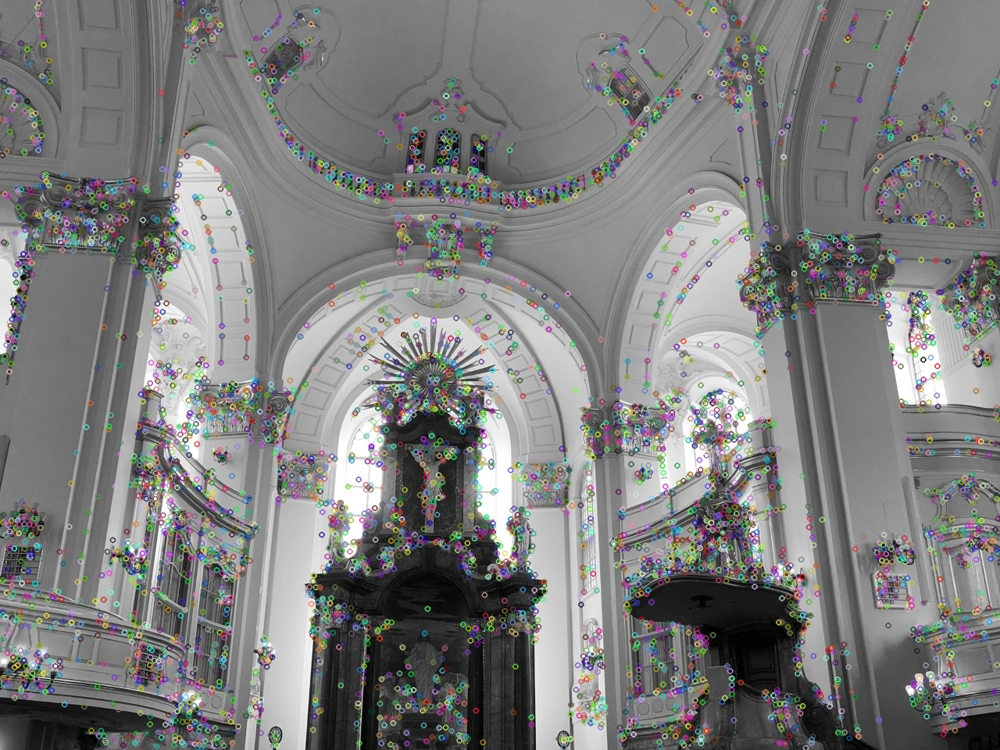
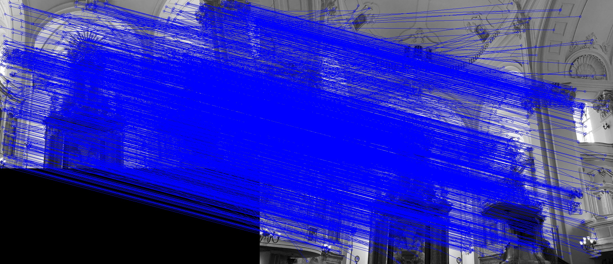
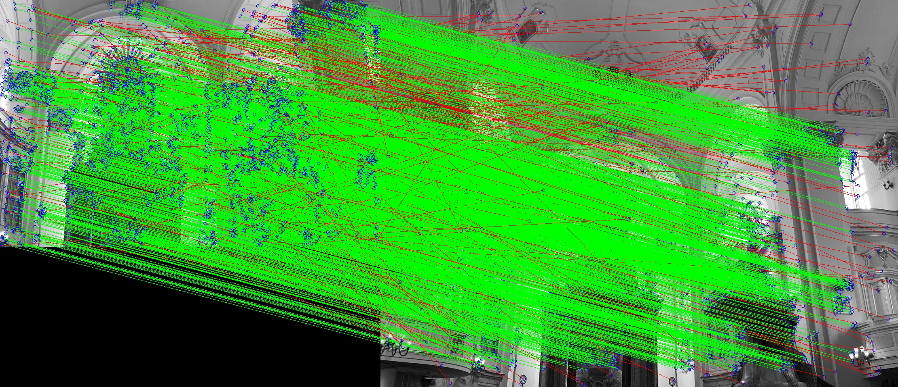

Robust Homography Estimation ***Method1*** is from [Jordan Hughes](https://github.com/hughesj919/HomographyEstimation). I fix few bugs using python3 and add detailed comments.

I want to thanks  Mr. Hughes here, his code helps me understand the scene behind the 2D Robust Homography.

Robust Homography Estimation ***Method2*** is slightly different from Method1. I replace the homography calculation part in ***Method1*** with [Normalized Direct Linear Transformation(DLT) Algorithm](https://www.youtube.com/watch?v=v3322cNhCTk&list=PLxg0CGqViygP47ERvqHw_v7FVnUovJeaz&index=9).

In ***Method1***, after the homography matrix H (3-by-3) is calculated from SVD (Singular Value Decomposition), H is normalized with the 9-th elements. However, this method doesn't consider the situation where A might be ill-conditioned (*different elements in A has different orders of magnitude*), s.t. Ah = 0. Readers may follow the ***link of Normalized DLT*** above to get more detailed information.

In ***Method2***, by applying ***Normalized DLT***, ill-conditioned situation is solved.

Both of the two methods are commented in detailed.

Run the script as follows:

```python3 robust_homography_method1.py --threshold=0.60 your_image_path.jpg your_image_path.jpg```

```python3 robust_homography_method2.py --threshold=0.60 your_image_path.jpg your_image_path.jpg```

Script will run and output the number of inliers, max inliers found via RANSAC. When done looping, the final estimated homography will be output as well. File output will be:

* homography.txt - final estimation of homography parameters
* Matches.png - shows all points and matches between the two images.
* InlierMatches.jpg. - draws all matches and colors them based on whether they are inliers in the final homography or not.
* sift_keypoints.jpg - all the keypoints found by the SIFT 

***Original Image Set 1***




##### Finding keypoints:



##### Bruteforce Matching:


##### Final inliers using Method2:



